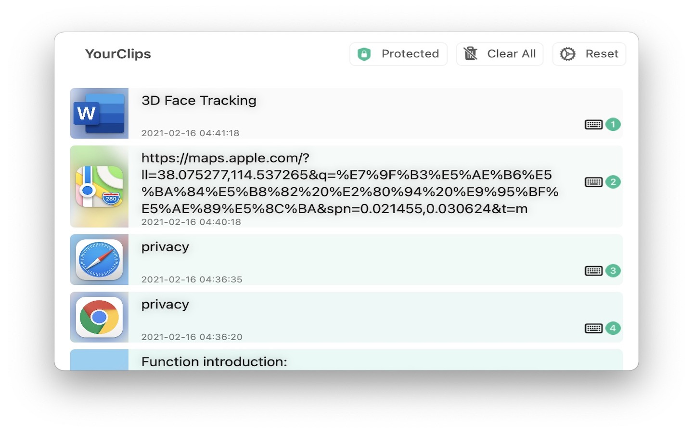
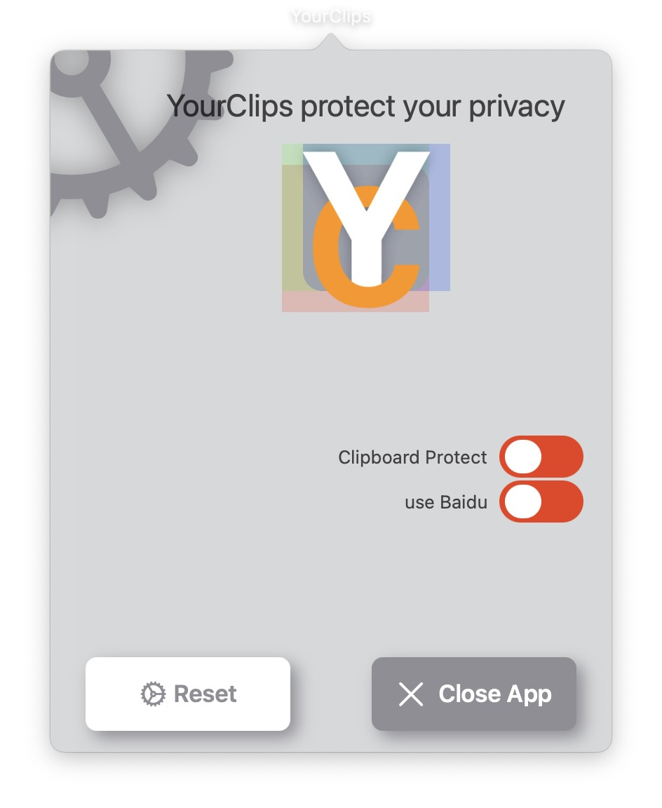

## Welcome to YourClips Pages

**YourClips** is committed to providing users with the most extreme clipboard experience. We help you optimize 95% of the usage scenarios and help users save valuable time


### Features

#### 1.**Yourclips** protects the privacy of your clipboard. When you use a Mac computer, all apps have permission to access the contents of your clipboard. The contents you copy may be read by advertisers. If you don’t want apps without your consent To read the contents of the clipboard, please use YourClips. As long as you use YourClips to paste the contents, other apps cannot read the contents you copied.

#### 2.Option+C Help you search text in Google very quickly, Select and Option+C. 
#### 3.**YourClips** saves your last 20 clipboard records

ShortCuts:

```
    'Command+C':        	Copy text as normal
    'Option+C':        		Copy text and search it
    'Shift+Command+V':  	Active YourClips app
    'J':            			Select next item
    'K':            			Select pre item
    'Q':            			Hide app window
    'X':            			Delete selected item
    '1-9':         			  Paste item on next active app
    '􀅇':           			Paste selected item on next active app
```
Option+C Help you search text in google very quickly, Select and Option+C. (Chinese User can change to Baidu)

Each content has a corresponding number, press the corresponding number on the keyboard to quickly paste the corresponding entry





### Support or Contact

```
Any questions, please contact Taontech@gmail.com
```

